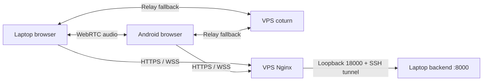

# Cross-network voice demo

**No VPS or payment card?** Follow [the laptop tunnel guide](TUNNEL_DEMO.md) using `./scripts/demo.sh --tunnel` and your Metered account. The steps below are for the VPS deployment.

The laptop and Android phone open the same public HTTPS site. WebRTC tries a direct audio connection and falls back to coturn. The operator browser copies the received caller audio to the laptop analysis backend. Model integration can follow once this demo is rehearsed.



The VPS serves the built frontend and TURN. Signaling, analysis, signing keys and audit data stay on the laptop. Keep the laptop awake and the launcher running. Use stable connections and calls under 30 minutes; automatic recovery while switching Wi-Fi/mobile data is outside this version.

## Prerequisites

- Linux VPS with Docker Engine, Docker Compose plugin, Python 3, OpenSSL and SSH key access. These templates use host networking; ports below must be available.
- A domain with two DNS **A** records, such as `demo.yourdomain.com` and `turn.yourdomain.com`, pointing directly to the VPS IPv4. Disable DNS proxying and remove AAAA records for these names in this IPv4 deployment.
- Laptop dependencies from [Setup](../README_frontend.md#setup). No trained model or local mkcert certificate is needed for online mode.
- Both devices can reach the public site and TURN service. Android Chrome uses its normal certificate trust; no Android app installation is required.

Allow these inbound ports in both the provider firewall and the VPS firewall:

| Port | Protocol | Purpose |
| --- | --- | --- |
| Your SSH port, usually 22 | TCP | Administration and laptop tunnel |
| 80 | TCP | Certificate issuance and renewal |
| 443 | TCP | Frontend and API/WebSockets |
| 3478 | UDP and TCP | STUN/TURN |
| 5349 | TCP | TURN over TLS |
| 49160–49260 | UDP | Relay media |

Keep VPS port 18000 and laptop port 8000 private. If changing TURN listener ports, update both environment files and firewall rules. This setup does not put TURN on TCP 443; networks permitting only HTTPS traffic may still block calls.

## 1. Prepare SSH access

Use one administrator SSH alias for deployment, and a separate account/key for the long-running tunnel. Verify the VPS SSH host-key fingerprint through the provider console before recording it in the laptop's `known_hosts`. The launcher requires strict host-key checking and non-interactive key authentication.

On the VPS, create the tunnel account and install the laptop's **public** key in its `~/.ssh/authorized_keys`. Set `.ssh` to mode 700 and `authorized_keys` to 600, owned by that account. Do not transfer the private key.

Apply this restriction to that account in the VPS SSH daemon configuration (replace `vif-tunnel` if needed):

```text
Match User vif-tunnel
    AuthenticationMethods publickey
    PasswordAuthentication no
    KbdInteractiveAuthentication no
    AllowTcpForwarding remote
    PermitListen 127.0.0.1:18000
    GatewayPorts no
    AllowAgentForwarding no
    X11Forwarding no
    PermitTTY no
    PermitTunnel no
    MaxSessions 0
Match all
```

Validate with `sudo sshd -t`, then reload the SSH service using your distribution's service command. Keep the administrator connection open while checking access. `MaxSessions 0` prevents shell/subsystem sessions while allowing forwarding; a normal interactive login with this account should fail. These restrictions follow the [OpenSSH server configuration](https://man.openbsd.org/sshd_config).

## 2. Upload the frontend and deployment assets

The commands below use an existing administrator alias `vif-vps`. From the laptop repository root:

```bash
npm run build
ssh vif-vps 'mkdir -p ~/voice-integrity-online/static'
rsync -av --exclude=.env --exclude=runtime --exclude=static deploy/online/ vif-vps:voice-integrity-online/
rsync -av dist/ vif-vps:voice-integrity-online/static/
```

Only `dist/` contents belong under `static/`. The helper rejects private files and symlinks there. Keep backend keys, local certificates and the repository off the public web root.

## 3. Configure and initialize the VPS

On the VPS:

```bash
cd ~/voice-integrity-online
cp .env.example .env
chmod 600 .env
openssl rand -hex 32
```

Edit `.env` with your real DNS names, public IPv4, certificate email and the generated random `TURN_SECRET`. Save the same secret for the laptop. `RELAY_IPV4` must be an address assigned to the VPS interface: normally the public IPv4; with provider 1:1 NAT, use the private interface address. The provider must forward the listener and relay ports without changing the relay port numbers.

```bash
python3 manage.py validate
sudo python3 manage.py preflight
sudo python3 manage.py init
```

`validate` checks configuration without networking. `preflight` checks Docker, DNS, static files, interface address and port conflicts. `init` starts an HTTP certificate challenge server, obtains one trusted certificate covering both DNS names, then starts HTTPS and authenticated coturn. It never stops unrelated services. An unchanged, interrupted bootstrap can be resumed with `sudo python3 manage.py init --resume` once its own containers have stopped.

The Compose file uses the upstream [coturn image and host networking](https://github.com/coturn/coturn/blob/master/docker/coturn/README.md). Certificate renewal uses Certbot's [webroot workflow](https://eff-certbot.readthedocs.io/en/stable/using.html#webroot). Generated configuration and certificates live in `runtime/`, with restricted permissions. TURN's long-term secret stays on the servers; browsers receive temporary credentials.

The frontend is available now; the API will return 502 until the laptop tunnel starts.

## 4. Start the laptop

From the repository root:

```bash
cp deploy/online/laptop.env.example .env.online
chmod 600 .env.online
```

Set `VIF_PUBLIC_ORIGIN`, `VIF_TURN_HOST`, matching `VIF_TURN_SECRET`, and `VIF_SSH_HOST` to the restricted account or its SSH alias. Optional `VIF_SSH_KEY`, `VIF_SSH_PORT` and `VIF_SSH_KNOWN_HOSTS` override your SSH configuration. Then run:

```bash
./scripts/demo.sh --online
```

The launcher starts the backend on laptop loopback 8000 and forwards VPS loopback 18000 to it. It retries lost SSH connections with delays capped at 30 seconds. It prints the public URL and a fresh operator access code. Open that URL on the laptop and sign in with the code. Ctrl+C stops the backend and tunnel.

On the VPS, confirm readiness:

```bash
cd ~/voice-integrity-online
sudo python3 manage.py check
```

This checks public HTTPS, the online backend through the tunnel, Nginx configuration and certificate validity. A forced-relay call is still needed to verify media/firewall reachability.

## 5. Rehearse two devices on different networks

1. Keep the laptop on Wi-Fi. Turn **off Wi-Fi on the phone** and use mobile data before opening the invitation. Keep both browsers in the foreground and use headphones.
2. Select a simulated detector scenario, create a call, and open its QR/link on the phone. Grant microphone access. Callers use the invitation and do not need the operator code.
3. Allow two seconds of quiet, then speak in each direction. Verify received audio on both devices and caller analysis on the laptop. The connection panel shows **Direct**, **Relayed** or **Unknown**, transport, round-trip time and received packet loss. Detector compute time is a separate measurement.
4. End the call. Verify the signed verdict, matching audit record and altered-verdict rejection.
5. Create a new call with **Force relay** checked. Both participants must show **Relayed**, with audible two-way speech and caller analysis. This validates TURN even when a direct route happens to work.
6. During an established call, interrupt only the laptop SSH tunnel. Audio should continue through the direct/TURN media path, and peer hang-up should still work. Analysis becomes unavailable. After the tunnel recovers, create a new call to restore analysis.

Invitations expire after 10 minutes if unused. TURN credentials last two hours from room creation. Operator cookies last eight hours and expire on backend restart. HTTP operator APIs and the analysis WebSocket require the cookie; invitation credentials authorize room signaling and ICE configuration. Online state-changing requests and WebSockets must come from the configured public origin.

## Maintenance and troubleshooting

- **502 / Backend unavailable:** keep the laptop awake; inspect launcher SSH errors and check `/health` through VPS loopback 18000. Verify the host key and that the tunnel account can bind that port.
- **Sign-in rejected:** use the current startup code. The browser URL must match `VIF_PUBLIC_ORIGIN` exactly. Repeated incorrect attempts are rate limited.
- **Connected but silent:** grant microphone permission, keep Chrome foregrounded, and use **Enable audio playback** if shown.
- **Relay timeout:** check TURN secret equality, DNS, both firewall layers, assigned relay IPv4 and coturn logs. Avoid publishing logs containing invitation credentials.
- **View service logs:** from the VPS deployment folder, run `sudo docker compose --env-file /dev/null logs --tail=100 nginx coturn`.
- **Certificate renewal:** run `sudo python3 manage.py renew --dry-run` once, then schedule `sudo python3 manage.py renew` daily with cron or a systemd timer, using the absolute helper path. Renewal reloads Nginx and restarts coturn only when a certificate changes; schedule outside demonstrations because the restart interrupts relayed calls.
- **Frontend update:** rebuild and upload `dist/` as in step 2, then reload both browser pages. Keep old hashed assets until existing pages finish their calls.
- **Restart VPS services:** `sudo python3 manage.py up`. Configuration is fixed after initialization; the helper refuses changed `.env` values instead of silently replacing a running deployment. Keep the initialized `.env` backed up securely.
- **Local-only demo:** stop the online launcher and use `./scripts/demo.sh` with the existing local certificate setup, or `./scripts/demo.sh --http` for laptop-only development.

## Automated checks and model handoff

```bash
npm test
npm run lint
npm run build
npm run test:browser
npm run test:relay
cd voice-integrity
.venv/bin/python -m pytest -q
```

The relay suite requires local coturn, OpenSSL and Playwright Chromium. See [relay test setup](../tests/relay/README.md). It tests authenticated online calls through a real local TURN server, two-way generated audio, signed verdict/audit, application WebSocket loss and invalid TURN credentials. It does not validate the VPS firewall, public certificate or physical Android mobile network; complete the rehearsal above before presenting.

The default backend remains `stub`, so scores demonstrate the pipeline. To integrate a model later, follow [the detector interface and model handoff](../README_frontend.md#interfaces-and-model-handoff) and change the laptop backend configuration. The phone and cross-network transport need no model-specific changes.
